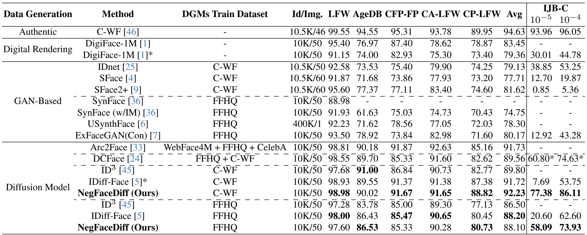

# This is the official repository of the paper [NegFaceDiff: The Power of Negative Context in Identity-Conditioned Diffusion for Synthetic Face Generation](https://arxiv.org/abs/2508.09661) (accepted at ICCV Workshop 2025)

## Results
## Generated Datasets Download
You can request access to the dataset generated with NegFaceDiff (Far-Neg, diffusion model pre-trained on CASIA-WebFace) [here](https://drive.google.com/drive/folders/1RXplM2j8cP4pyljcHweoq5I_xZFi3h_T?usp=sharing). This folder also contains the pre-trained diffusion model weights and the weights of the FR model trained on the generated data. **Please share your name, affiliation, and official email in the request form.**

### Face Recognition - Comparison with SOTA

## Training Datasets Download
You can download the FFHQ dataset [here](https://github.com/NVlabs/ffhq-dataset) and the CASIA-WebFace dataset [here](https://github.com/deepinsight/insightface/tree/master/recognition/_datasets_).

## How to Run?

### SetUp

The pre-trained autoencoder for the latent diffusion training and sampling can be obtained from the pre-trained fhq256 LDM from [Rombach et al.](https://github.com/CompVis/latent-diffusion/blob/main/models/ldm/ffhq256/config.yaml) (please follow their licence distribution). These files should be saved under `models/autoencoder`.

To run `face_recognition_training/distribution.py`, the pre-trained ElasticFace-Cos model weights have to be downloaded from the [official ElasticFace repository](https://github.com/fdbtrs/ElasticFace) and placed under `output/ElasticCos.pth`.

### IDiff-Face Training
To train IDiff-Face, follow the setup described in the [official repository of the paper](https://github.com/fdbtrs/IDiff-Face), where all the necessary scripts and configuration are provided. 

To apply NegFaceDiff on top of an already trained diffusion model, we provide access to the pre-trained models used in this work:
- model trained on FFHQ: can be accessed in [IDiff-Face's official repository](https://github.com/fdbtrs/IDiff-Face)
- model trained on CASIA: request access as detailed in section **Generated Datasets Download**

### Positive Context List Generation
1. Run `create_sample_identity_contexts.py` to create the list of positive contexts used during sampling. Since each context represents an identity on the generated dataset, `n_contexts` should be equal or greater than the number of identities to be generated

### Negative Context List Generation
1. Run `find_closest_context.py` (Close-Neg), `find_median_context.py` (Mid-Neg) or `find_farthest_context.py` (Far-Neg). Rand-Neg does not require the generation of a negative context list prior to sampling

### Data Sampling + Alignment
1. Run `sample.py` to generate the synthetic dataset
2. Run `split_identity_blocks.py` to split the block of samples generated for each identity into individual images
3. Run `MTCNN_alignment.py` to align the samples and obtain the final dataset

Most relevant configurations (`configs/sample_configs.yalm`): 
- `neg_prompt.w`: value of the negative context scale parameter (in this work, `neg_prompt.w = 0.5`)
- `sampling.is_ddim`: set to `true` to sample with DDIM and to `false` to sample with DDPM
- `sampling.method`: `none -> Baseline IDiff-Face` (with `neg_prompt.w = 0`), `empty -> Null`, `cc -> Close-Neg`, `mc -> Mid-Neg`, `fc -> Far-Neg`, `rand -> Rand-Neg`

### Distribution Plots + FR Training
1. Run `face_recognition_training/distribution.py` to generate the genuine and impostor score distribution plots, as well as two `.txt` files containing these scores
2. Change to the directory where these files are saved and run `geteerinf -p $OUTPUT_DIR -i "cos_sim_imp.txt" -g "cos_sim_gen.txt"` to generate the distribution metrics presented in the paper (EER, FMR100, FMR1000, genuine and impostor Mean and STD)
3. Run `face_recognition_training/train.py` to train a FR system with the synthetically generated data
4. Run `eval_ijbc.py` to perform IJB-C evaluation

## Citation

If you use any of the code, pruned datasets or models provided in this repository, please cite the following paper:

<pre>@misc{caldeira2025negfacediff,
      title={NegFaceDiff: The Power of Negative Context in Identity-Conditioned Diffusion for Synthetic Face Generation}, 
      author={Eduarda Caldeira and Naser Damer and Fadi Boutros},
      year={2025},
      eprint={2508.09661},
      archivePrefix={arXiv},
      primaryClass={cs.CV},
      url={https://arxiv.org/abs/2508.09661}, 
} </pre>

## License

<pre>This project is licensed under the terms of the Attribution-NonCommercial 4.0 International (CC BY-NC 4.0) license. 
Copyright (c) 2025 Fraunhofer Institute for Computer Graphics Research IGD Darmstadt </pre>
